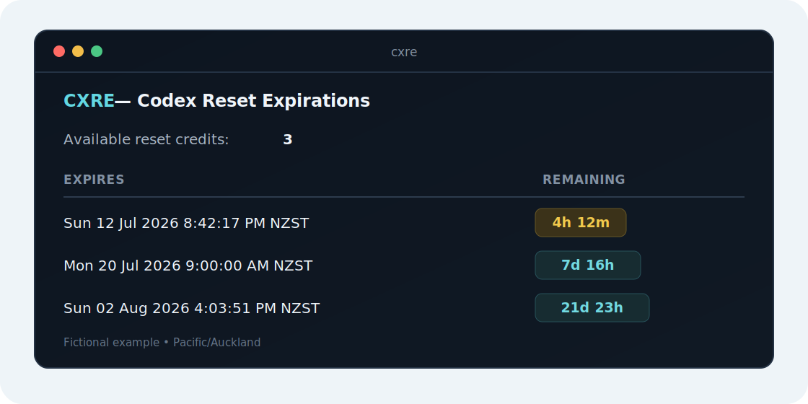

# CXRE

> **Know exactly when your Codex reset credits expire.**

[](https://github.com/rcmcsweeney/cxre/actions/workflows/ci.yml)
[](https://github.com/rcmcsweeney/cxre/releases)
[](LICENSE)

CXRE (Codex Reset Expirations) is a small, read-only CLI that shows the exact
expiration time for every available Codex manual reset credit. It starts as a
single native executable, sorts the credits that expire first, and adds a
useful countdown without hiding the underlying timestamp.

CXRE is an **unofficial community tool**. It is not affiliated with, endorsed
by, or maintained by OpenAI.



The screenshot and every example in this README use fictional data.

## Requirements

- [Codex CLI](https://developers.openai.com/codex/cli) 0.143.0 or newer on
  `PATH`.
- A ChatGPT account already signed in through Codex. Run `codex login` if
  needed.

CXRE deliberately delegates authentication to Codex. API-key-only and Amazon
Bedrock Codex environments are not supported in v0.1.

## Install

### Homebrew

```sh
brew install rcmcsweeney/tap/cxre
```

The tap is updated automatically by each stable release. Codex itself remains
a separate prerequisite.

### GitHub Releases

Download the archive for your platform from
[GitHub Releases](https://github.com/rcmcsweeney/cxre/releases), extract it,
and place `cxre` (or `cxre.exe`) somewhere on your `PATH`.

Release archives are available for:

- macOS: Apple Silicon and Intel
- Linux: AMD64 and ARM64
- Windows: AMD64

Each release includes `checksums.txt`, per-archive SBOMs, and GitHub artifact
provenance. Verify an archive with:

```sh
sha256sum -c checksums.txt --ignore-missing
gh attestation verify cxre_0.1.0_Darwin_arm64.tar.gz -R rcmcsweeney/cxre
```

On macOS, use `shasum -a 256` if `sha256sum` is unavailable. Initial CXRE
releases are not code-signed or notarized, so macOS Gatekeeper or Windows
SmartScreen may ask for confirmation even when the checksum and provenance are
valid.

### From source

With Go 1.25 or newer:

```sh
go install github.com/rcmcsweeney/cxre/cmd/cxre@latest
```

### Scoop

A Scoop manifest is prepared under [`packaging/scoop`](packaging/scoop), but no
public bucket is published yet. See its README if you maintain a Scoop bucket.

## Use

```text
cxre             Show reset-credit expiration times.
cxre --json      Emit stable machine-readable JSON.
cxre --utc       Display timestamps in UTC.
cxre --version   Display build version information.
cxre --help      Show help.
cxre -h          Show help.
```

Options may be combined, for example `cxre --json --utc`. CXRE v0.1 accepts no
positional commands. That leaves room for future commands without making the
first release more complicated.

### Terminal output

```text
CXRE — Codex Reset Expirations

Available reset credits: 3

Expires                           Remaining
------------------------------------------------
Sun 12 Jul 2026 8:42:17 PM NZST  4h 12m
Mon 20 Jul 2026 9:00:00 AM NZST  7d 16h
Sun 02 Aug 2026 4:03:51 PM NZST  21d 23h
```

Times use the operating system's local timezone unless `--utc` is set. Credits
are sorted by the earliest expiration; credits that do not expire appear last.
Countdowns are floored and use compact units:

- days and hours at one day or more;
- hours and minutes at one hour or more;
- minutes and seconds at one minute or more;
- seconds below one minute;
- `expired` for a timestamp at or before the current time.

On an interactive terminal, CXRE uses restrained color and Unicode status
marks. It automatically disables ANSI styling when output is redirected,
`TERM=dumb` or `NO_COLOR` is set, or the Windows console cannot support it;
Unicode marks appear only on a capable locale and console. Below 60 columns,
the table changes to stacked rows instead of truncating timestamps.

### JSON schema v1

`--json` writes one JSON document to stdout and no decorative text. `--utc`
changes RFC 3339 strings and the reported timezone; Unix values are unchanged.
In local mode the `timezone` field uses the operating system's IANA zone name
when available, with the active timezone abbreviation as a portable fallback.

```json
{
  "schema_version": 1,
  "generated_at": "2026-07-12T13:14:49+12:00",
  "timezone": "Pacific/Auckland",
  "available_count": 3,
  "detailed_count": 3,
  "missing_count": 0,
  "complete": true,
  "credits": [
    {
      "expires_at": "2026-07-12T20:42:17+12:00",
      "expires_at_unix": 1783845737,
      "remaining_seconds": 26848,
      "expired": false,
      "does_not_expire": false
    }
  ],
  "warnings": []
}
```

For a credit that never expires, `expires_at`, `expires_at_unix`, and
`remaining_seconds` are `null`, while `does_not_expire` is `true`. CXRE never
puts opaque credit IDs, account details, titles, or descriptions in this
output.

The schema is versioned independently of the executable. Additive fields may
appear within schema version 1; incompatible changes require a new
`schema_version`.

### Partial data

Codex can report an authoritative available count while returning fewer
individual expiry rows. CXRE does not invent the missing timestamps. It shows
the known rows, emits a warning, sets `complete` to `false`, and reports the
difference in `missing_count`. This is a successful query and exits 0. An
explicit count of zero is also successful; a missing reset-credit summary is
an operational error.

## Errors and exit codes

| Exit | Meaning |
| ---: | --- |
| `0` | Successful query, including explicitly empty or partial data |
| `1` | Authentication, Codex, timeout, network, or protocol failure |
| `2` | Invalid flags or positional arguments |

Human errors are short and actionable. With `--json`, stdout stays empty and
stderr contains one sanitized object:

```json
{
  "error": {
    "code": "auth_missing",
    "message": "Unable to find Codex authentication.",
    "action": "Run `codex login`, sign in with ChatGPT, then run `cxre` again."
  }
}
```

Stable error codes are `usage`, `codex_not_found`, `auth_missing`,
`unsupported_auth`, `codex_too_old`, `timeout`, `network`, `protocol`, and
`output`. Backend response bodies, child-process stderr, and credentials are
never copied into user-facing errors.

### Troubleshooting

**CXRE cannot find Codex**

Confirm `codex --version` works in the same shell. For an unusual installation,
set `CXRE_CODEX` to the Codex executable path.

**CXRE cannot find authentication**

```sh
codex login
cxre
```

You never need to copy a token into CXRE.

**CXRE says Codex is too old**

Update Codex to 0.143.0 or newer, then retry. CXRE also feature-detects reset
expiry details because the protocol can evolve independently of version
numbers.

**The result is incomplete**

CXRE displayed every expiry row Codex provided. Update Codex and retry later;
the reported count remains authoritative, and the warning identifies how many
timestamps are unavailable.

## Privacy and security

Credentials are passwords. CXRE is intentionally designed so it never needs
to possess them:

1. It starts one `codex app-server --stdio` child process.
2. It initializes the documented
   [Codex app-server protocol](https://developers.openai.com/codex/app-server).
3. It asks Codex for `account/read` with `refreshToken: false`, then
   `account/rateLimits/read`.
4. It normalizes reset-credit counts and expiration timestamps in memory,
   terminates the child, and renders the result.

CXRE does **not** read Codex's `auth.json`, query an operating-system keychain,
store credentials, print tokens, send telemetry, consume reset credits, or
make direct network requests. Codex owns its normal credential caching and
service communication, as described by the
[Codex authentication documentation](https://developers.openai.com/codex/auth).
CXRE inherits the normal process environment, including `CODEX_HOME`, without
searching private credential paths.

CXRE uses only the account type and reset-credit rate-limit data needed for this
command; the app-server response passes through memory while it is decoded.
Raw app-server messages and stderr are never logged. See
[SECURITY.md](SECURITY.md) for vulnerability reporting.

## Development

```sh
make build        # bin/cxre
make test         # unit and fake app-server tests
make test-race    # race detector
make check        # format, module, vet, and tests
make vulncheck    # Go vulnerability database
make snapshot     # local GoReleaser snapshot
```

The optional live integration test uses an existing Codex sign-in and records
no real identifiers or timestamps:

```sh
CXRE_INTEGRATION=1 go test ./...
```

The code is split into small internal packages for CLI dispatch, Codex JSONL
transport, reset-credit domain logic, terminal/JSON rendering, and build
metadata. See [CONTRIBUTING.md](CONTRIBUTING.md) before proposing a change.

Releases follow Semantic Versioning. A `vX.Y.Z` tag runs tests, builds static
archives, generates checksums and SBOMs, publishes a GitHub Release, records
provenance, updates `rcmcsweeney/homebrew-tap`, and runs each archive's help and
version paths on a matching native hosted runner.

## Scope

Version 1 is deliberately about reset expirations. The internal command
registry leaves space for possible future commands such as `cxre status`,
`cxre limits`, and `cxre account`, but none are promised yet.

## License

[MIT](LICENSE) © 2026 CXRE contributors.
