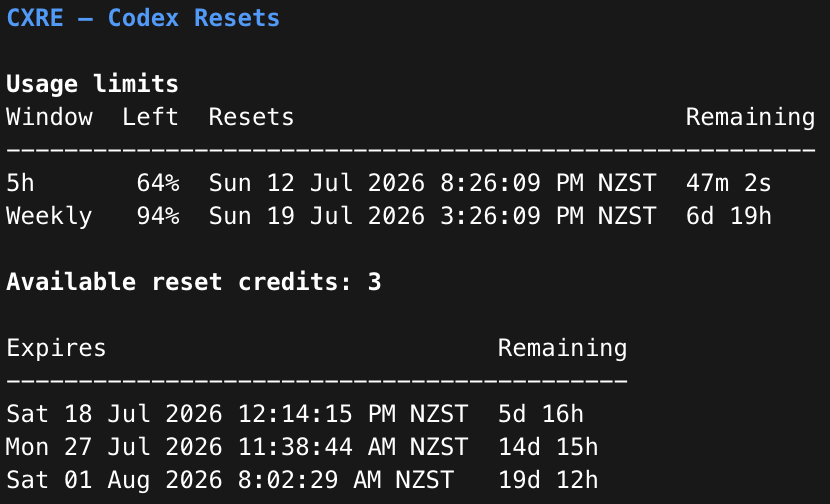

# CXRE

> **See when your Codex limits reset and reset credits expire.**

[](https://github.com/rcmcsweeney/cxre/actions/workflows/ci.yml)
[](https://github.com/rcmcsweeney/cxre/releases)
[](LICENSE)

CXRE (Codex Resets) is a small, read-only command-line tool for checking Codex
usage limits and reset-credit expiration times. It uses the ChatGPT account
already signed in through the official Codex CLI.

CXRE is an **unofficial community tool**. It is not affiliated with, endorsed
by, or maintained by OpenAI.

## Quick start

### 1. Check Codex

You need [Codex CLI](https://developers.openai.com/codex/cli) 0.143.0 or later
and a ChatGPT sign-in:

```sh
codex --version
codex login status
```

If Codex says you are not signed in, run `codex login` and choose ChatGPT. CXRE
never asks you to copy or paste a token. API-key-only and Amazon Bedrock
sessions are not supported in v0.1.x.

### 2. Install CXRE

#### macOS

```sh
brew install rcmcsweeney/tap/cxre
```

#### Linux

If you already use Homebrew, run the same one-line command:

```sh
brew install rcmcsweeney/tap/cxre
```

Otherwise, follow the short [Linux download steps](#linux-download) below.

#### Windows

Download the files ending in `_Windows_x86_64.zip` and `checksums.txt` from the
[latest release](https://github.com/rcmcsweeney/cxre/releases/latest). Follow
[Verify a direct download](#verify-a-direct-download) before opening the ZIP.
Then, in PowerShell, open your Downloads folder and run:

```powershell
Expand-Archive .\cxre_*_Windows_x86_64.zip -DestinationPath .\cxre
.\cxre\cxre.exe --version
.\cxre\cxre.exe
```

That is enough to try CXRE. See [Windows download](#windows-download) if you
want the `cxre` command to work from every folder.

### 3. Run it

On macOS or Linux:

```sh
cxre
```

From the Windows quick-start folder:

```powershell
.\cxre\cxre.exe
```

Useful alternatives are `--utc`, `--json`, and `--help`, added after either
command above.

## What you will see



CXRE shows the percentage left in the five-hour and weekly windows, the exact
time each window resets, and each usable unique reset-credit expiration it can
safely retain, soonest first. The screenshot shows real terminal output; the
text examples below use fictional data.

## Install details

### Homebrew

```sh
brew install rcmcsweeney/tap/cxre
```

The fully qualified command adds the tap and installs CXRE in one step. Codex
itself remains a separate prerequisite.

### Verify a direct download

CXRE v0.1.x is not code-signed yet, so macOS or Windows may ask you to confirm
the first launch of a direct download. This is expected. Verify the download,
then use macOS's normal **Open Anyway** flow or Windows's **More info → Run
anyway** option. Do not disable your operating system's security checks.

<details>
<summary>Checksum and provenance commands</summary>

Each release includes `checksums.txt`, per-archive SBOMs, and GitHub artifact
provenance. Download `checksums.txt` beside the archive before extracting it.
The provenance commands require [GitHub CLI](https://cli.github.com/). On
Linux:

```sh
sha256sum -c checksums.txt --ignore-missing
gh attestation verify cxre_*_Linux_*.tar.gz -R rcmcsweeney/cxre
```

On macOS:

```sh
shasum -a 256 cxre_*_Darwin_*.tar.gz
grep 'Darwin' checksums.txt
gh attestation verify cxre_*_Darwin_*.tar.gz -R rcmcsweeney/cxre
```

The two checksum values must match. On Windows PowerShell:

```powershell
$archive = Get-Item .\cxre_*_Windows_x86_64.zip
Get-FileHash $archive.FullName -Algorithm SHA256
Select-String -Path .\checksums.txt -Pattern $archive.Name
gh attestation verify $archive.FullName -R rcmcsweeney/cxre
```

The two checksum values must match before you continue.

</details>

### Linux download

Most Linux PCs use the file ending in `_Linux_x86_64.tar.gz`; ARM64 computers
use `_Linux_arm64.tar.gz`. Download the matching archive from the
[latest release](https://github.com/rcmcsweeney/cxre/releases/latest) together
with `checksums.txt`. Verify the archive before extracting it:

```sh
sha256sum -c checksums.txt --ignore-missing
gh attestation verify cxre_*_Linux_*.tar.gz -R rcmcsweeney/cxre
mkdir -p cxre-download
tar -xzf cxre_*_Linux_*.tar.gz -C cxre-download
mkdir -p "$HOME/.local/bin"
install -m 0755 cxre-download/cxre "$HOME/.local/bin/cxre"
export PATH="$HOME/.local/bin:$PATH"
cxre --version
```

The `export` affects the current shell. If `cxre` is not found after opening a
new terminal, add `$HOME/.local/bin` to the PATH setting in your shell profile.

### Windows download

The PowerShell commands in [Quick start](#quick-start) run CXRE directly from
the extracted folder. To make `cxre` available in new PowerShell windows:

```powershell
New-Item -ItemType Directory -Force "$HOME\bin" | Out-Null
Copy-Item .\cxre\cxre.exe "$HOME\bin\cxre.exe"
$path = [Environment]::GetEnvironmentVariable("Path", "User")
if (($path -split ";") -notcontains "$HOME\bin") {
  [Environment]::SetEnvironmentVariable("Path", "$path;$HOME\bin", "User")
}
```

Close and reopen PowerShell, then run `cxre --version`.

### From source (advanced)

With Go 1.25 or newer:

```sh
go install github.com/rcmcsweeney/cxre/cmd/cxre@latest
cxre --version
```

Tagged source installs report the released CXRE version. Builds whose embedded
Go module version is `(devel)` report `cxre dev`.

### Scoop

A Scoop manifest is prepared under [`packaging/scoop`](packaging/scoop), but no
public bucket is published yet. See its README if you maintain a Scoop bucket.

## Use

```text
cxre             Show usage limits and reset-credit expiration times.
cxre --json      Emit stable machine-readable JSON.
cxre --utc       Display timestamps in UTC.
cxre --version   Display build version information.
cxre --help      Show help.
cxre -h          Show help.
```

Options may be combined, for example `cxre --json --utc`. CXRE v0.1 accepts no
positional commands. That leaves room for future commands without making the
first release more complicated.

### Terminal output

<!-- BEGIN README TERMINAL EXAMPLE -->
```text
CXRE — Codex Resets

Usage limits
Window  Left  Resets                            Remaining
---------------------------------------------------------
5h       63%  Sun 12 Jul 2026 5:00:00 PM NZST   3h 45m
Weekly   39%  Sat 18 Jul 2026 12:00:00 PM NZST  5d 22h

Available reset credits: 3

Expires                          Remaining
------------------------------------------
Sun 12 Jul 2026 8:42:17 PM NZST  7h 27m
Mon 20 Jul 2026 9:00:00 AM NZST  7d 19h
Sun 02 Aug 2026 4:03:51 PM NZST  21d 2h
```
<!-- END README TERMINAL EXAMPLE -->

Times use the operating system's local timezone unless `--utc` is set. Limit
percentages show the amount left, matching Codex's presentation. Credits are
sorted by the earliest expiration; credits that do not expire appear last.
Countdowns are floored and use compact units:

- days and hours at one day or more;
- hours and minutes at one hour or more;
- minutes and seconds at one minute or more;
- seconds below one minute;
- `expired` for a timestamp at or before the current time.

On an interactive terminal, CXRE uses restrained color and Unicode status
marks. It automatically disables ANSI styling when output is redirected,
`TERM=dumb` or `NO_COLOR` is set, or the Windows console cannot support it;
Unicode marks appear only on a capable locale and console. Below 60 columns,
the table changes to stacked rows instead of truncating timestamps.

### JSON schema v1

`--json` writes one JSON document to stdout and no decorative text. `--utc`
changes RFC 3339 strings and the reported timezone; Unix values are unchanged.
In local mode the `timezone` field uses the operating system's IANA zone name
when available, with the active timezone abbreviation as a portable fallback.

<!-- BEGIN README JSON EXAMPLE -->
```json
{
  "schema_version": 1,
  "generated_at": "2026-07-12T13:14:49+12:00",
  "timezone": "Pacific/Auckland",
  "limits": {
    "five_hour": {
      "used_percent": 37,
      "remaining_percent": 63,
      "resets_at": "2026-07-12T17:00:00+12:00",
      "resets_at_unix": 1783832400,
      "remaining_seconds": 13511,
      "reset_due": false
    },
    "weekly": {
      "used_percent": 61,
      "remaining_percent": 39,
      "resets_at": "2026-07-18T12:00:00+12:00",
      "resets_at_unix": 1784332800,
      "remaining_seconds": 513911,
      "reset_due": false
    }
  },
  "available_count": 3,
  "detailed_count": 3,
  "missing_count": 0,
  "complete": true,
  "credits": [
    {
      "expires_at": "2026-07-12T20:42:17+12:00",
      "expires_at_unix": 1783845737,
      "remaining_seconds": 26848,
      "expired": false,
      "does_not_expire": false
    },
    {
      "expires_at": "2026-07-20T09:00:00+12:00",
      "expires_at_unix": 1784494800,
      "remaining_seconds": 675911,
      "expired": false,
      "does_not_expire": false
    },
    {
      "expires_at": "2026-08-02T16:03:51+12:00",
      "expires_at_unix": 1785643431,
      "remaining_seconds": 1824542,
      "expired": false,
      "does_not_expire": false
    }
  ],
  "warnings": []
}
```
<!-- END README JSON EXAMPLE -->

`limits.five_hour` and `limits.weekly` are `null` when Codex does not provide a
recognized window. If a percentage is available without a reset timestamp, the
window remains present while `resets_at`, `resets_at_unix`,
`remaining_seconds`, and `reset_due` are `null`; human output shows `—` for the
unknown values. A missing or partial usage window does not change the
reset-credit `complete` field or the exit code. JSON exposes both the upstream
`used_percent` value and the derived, clamped `remaining_percent` shown in the
terminal.

For a credit that never expires, `expires_at`, `expires_at_unix`, and
`remaining_seconds` are `null`, while `does_not_expire` is `true`. CXRE never
puts opaque credit IDs, account details, titles, or descriptions in this
output.

The schema is versioned independently of the executable. Additive fields may
appear within schema version 1; incompatible changes require a new
`schema_version`.

### Partial data

Codex can report an authoritative available count while returning fewer
individual expiry rows. CXRE does not invent the missing timestamps. It shows
the known rows, emits a warning, sets `complete` to `false`, and reports the
difference in `missing_count`. This is a successful query and exits 0. An
explicit count of zero is also successful. If Codex explicitly reports that
reset-credit information is unavailable for the account, CXRE exits 1 with the
actionable `reset_credits_unavailable` error instead of guessing that the count
is zero.

## Errors and exit codes

| Exit | Meaning |
| ---: | --- |
| `0` | Successful query, including explicitly empty or partial data |
| `1` | Authentication, Codex, timeout, network, or protocol failure |
| `2` | Invalid flags or positional arguments |
| `130` | Interrupted with Ctrl-C; no error is printed |
| `143` | Terminated with SIGTERM on Unix; no error is printed |

Human errors are short and actionable. With `--json`, stdout stays empty and
stderr contains one sanitized object:

```json
{
  "error": {
    "code": "auth_missing",
    "message": "Unable to find Codex authentication.",
    "action": "Run `codex login`, sign in with ChatGPT, then run `cxre` again."
  }
}
```

Stable error codes are `usage`, `codex_not_found`,
`codex_invalid_executable`, `auth_missing`, `unsupported_auth`,
`codex_too_old`, `reset_credits_unavailable`, `timeout`, `network`, `protocol`,
and `output`. Backend response bodies, child-process stderr, configured paths,
and credentials are never copied into user-facing errors.

### Troubleshooting

**CXRE cannot find Codex**

Confirm `codex --version` works in the same shell. For an unusual installation,
set `CXRE_CODEX` to the Codex executable path.

**CXRE says the selected Codex executable is invalid**

Correct or unset `CXRE_CODEX`, or reinstall Codex, then run `cxre` again. CXRE
never prints the configured path in its error output.

**CXRE cannot find authentication**

```sh
codex login
cxre
```

You never need to copy a token into CXRE.

**CXRE says Codex is too old**

Update Codex to 0.143.0 or newer, then retry. CXRE also feature-detects reset
expiry details because the protocol can evolve independently of version
numbers.

**Reset-credit information is unavailable**

This is different from having zero credits. Try again later. If the message
continues, reset credits may not be available for your ChatGPT plan or
workspace; the Codex app server deliberately returned no reset-credit summary.

**The result is incomplete**

CXRE displayed every usable unique expiry row it could safely retain. The
reported count remains authoritative. A `partial_reset_credit_details` warning
quantifies missing expiration details; an `inconsistent_reset_credit_details`
warning identifies duplicate, conflicting, unidentifiable, or otherwise
unreliable rows and may not include a numeric count. Update Codex and retry
later.

## Privacy and security

Credentials are passwords. CXRE is intentionally designed so it never needs
to possess them:

1. It starts one `codex app-server --stdio` child process.
2. It initializes the documented
   [Codex app-server protocol](https://developers.openai.com/codex/app-server).
3. It asks Codex for `account/read` with `refreshToken: false`, then
   `account/rateLimits/read`.
4. It normalizes recognized quota windows, reset-credit counts, and expiration
   timestamps in memory, terminates the child, and renders the result.

CXRE does **not** read Codex's `auth.json`, query an operating-system keychain,
store credentials, print tokens, send telemetry, consume reset credits, or
make direct network requests. Codex owns its normal credential caching and
service communication, as described by the
[Codex authentication documentation](https://developers.openai.com/codex/auth).
CXRE inherits the normal process environment, including `CODEX_HOME`, without
searching private credential paths.

CXRE uses only the account type, recognized quota windows, and reset-credit
rate-limit data needed for this command; the app-server response passes through
memory while it is decoded.
Raw app-server messages and stderr are never logged. See
[SECURITY.md](SECURITY.md) for vulnerability reporting.

## Development

```sh
make build        # bin/cxre
make test         # unit and fake app-server tests
make test-race    # race detector
make check        # format, module, vet, and tests
make vulncheck    # Go vulnerability database
make snapshot     # local GoReleaser snapshot
```

The optional live integration test uses an existing Codex sign-in and records
no real identifiers or timestamps:

```sh
CXRE_INTEGRATION=1 go test ./...
```

The code is split into small internal packages for CLI dispatch, Codex JSONL
transport, usage-limit and reset-credit domain logic, terminal/JSON rendering,
and build metadata. See [CONTRIBUTING.md](CONTRIBUTING.md) before proposing a
change.

Releases follow Semantic Versioning. A `vX.Y.Z` tag runs tests, builds static
archives once, verifies each archive on a matching native hosted runner, and
attests those exact bytes. Only then does the workflow publish the GitHub
Release, test the generated Homebrew formula, and update
`rcmcsweeney/homebrew-tap`.

## Scope

Version 1 remains focused on reset expirations; the two standard usage windows
provide concise context above that data. The internal command registry leaves
space for possible future commands such as `cxre status`, `cxre limits`, and
`cxre account`, but none are promised yet.

## License

[MIT](LICENSE) © 2026 CXRE contributors.
